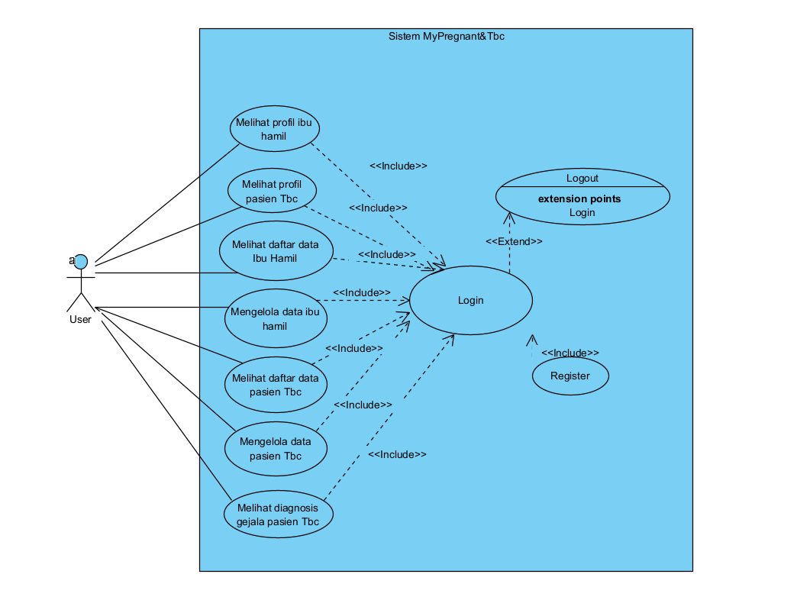
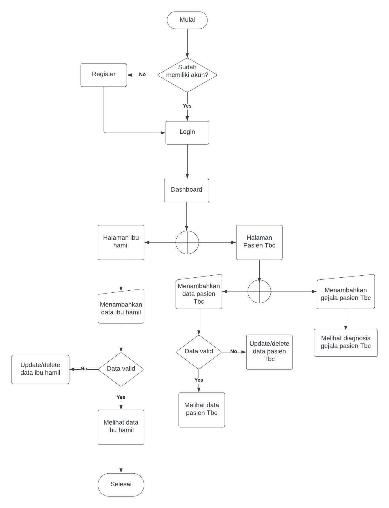

# MyPregnant&TBC

Aplikasi MyPregnant&Tbc adalah aplikasi pendataan khusus ibu hamil dan tubercolosis yang dimana nantinya ada fitur management data untuk ibu hamil dan pasien tubercolosis yang akan diisi langsung oleh pasien ibu hamil dan pasien tubercolosis. Aplikasi ini bertujuan untuk memantau perkembangan janin pada ibu hamil dan gejala pada tubercolosis. Pada aplikasi ini juga terdapat diagnosis gejala pada Tbc untuk mengukur sejauh mana gejala Tbc tersebut telah berkembang serta adanya pemantauan untuk ibu hamil agar dapat mengetahui sejauh mana janin pada ibu hamil telah berkembang secara online.s Berikut rancangan dari aplikasi MyPregnant&Tbc :
 
## 1. Usecase Diagram

## 2. Flowchart

